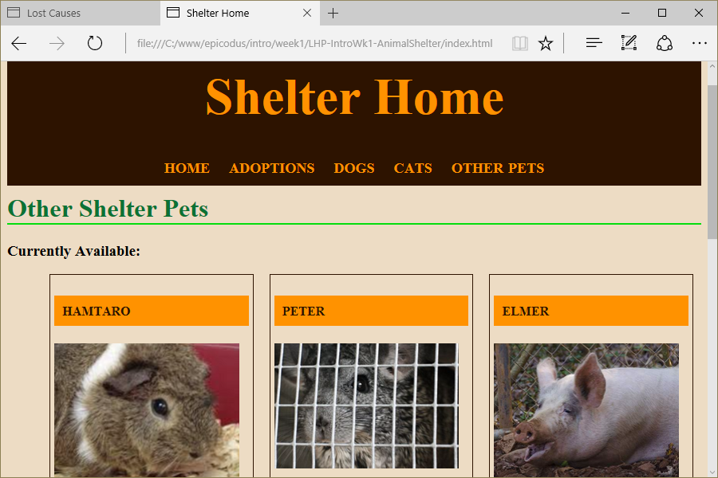

# Animal Shelter
Version 0.2.0: June 28, 2016
by [Karen Freeman-Smith](https://karenfreemansmith.github.io)

### Technologies Used
HTML, CSS/Sass, JavaScript, jQuery, Angular.js, Git, Github

## Description
[Learn How to Program](http://learnhowtoprogram.com) Intro to Programming Week 1 Independent Project: Design a website for an animal shelter to practice using CSS page layout and media queries.
* Version 0.0.2 - Add appointment schedule form & response
* Version 0.2.0 - Convert site to Angular.js

## Setup/Installation
* [View on Github Pages](https://karenfreemansmith.github.io/LHP-IntroWk1-AnimalShelter)

 __OR__
* Clone project to your computer
* Open index.html in your favorite browser

## Support & Contact
For questions, concerns, or suggestions please email karenfreemansmith@gmail.com

## Known Issues
* None

## Legal
* Licensed under the GNU General Public License v3.0

Copyright (c) 2016 Copyright _[Karen Freeman-Smith](https://karenfreemansmith.github.io)_ All Rights Reserved.
